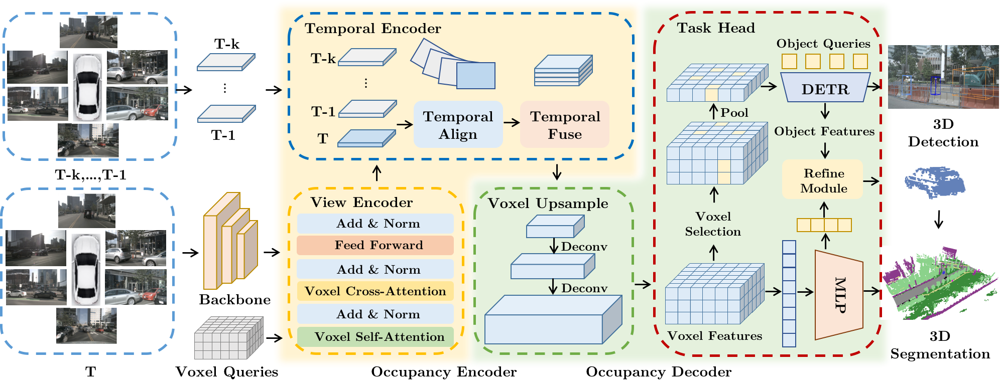

# <center>PanoOcc<center>
> **PanoOcc: Unified Occupancy Representation for Camera-based 3D Panoptic Segmentation** [[paper](https://arxiv.org/abs/2306.10013)]

# News 
- **[2024/2/27]** PanoOcc is accepted by CVPR 2024
- **[2023/6/29]** Code initialization, support occupancy prediction
- **[2023/6/16]** We release the arXiv version ([Paper in arXiv](https://arxiv.org/abs/2306.10013))


# Catalog
- [ ] 3D Panoptic Segmentation (Waymo)
- [ ] Sparse Decoder, Panoptic Refine
- [x] 3D Panoptic Segmentation (nuScenes)
- [x] Occupancy Prediction (Occ3D-nuScenes)
- [x] Initialize

# Introduction
Comprehensive modeling of the surrounding 3D world is key to the success of autonomous driving. However, existing perception tasks like object detection, road structure segmentation, depth & elevation estimation, and open-set object localization each only focus on a small facet of the holistic 3D scene understanding task. This divide-and-conquer strategy simplifies the algorithm development procedure at the cost of losing an end-to-end unified solution to the problem. In this work, we address this limitation by studying camera-based 3D panoptic segmentation, aiming to achieve a unified occupancy representation for camera-only 3D scene understanding. To achieve this, we introduce a novel method called PanoOcc, which utilizes voxel queries to aggregate spatiotemporal information from multi-frame and multi-view images in a coarse-to-fine scheme, integrating feature learning and scene representation into a unified occupancy representation. We have conducted extensive ablation studies to verify the effectiveness and efficiency of the proposed method. Our approach achieves new state-of-the-art results for camera-based semantic segmentation and panoptic segmentation on the nuScenes dataset. Furthermore, our method can be easily extended to dense occupancy prediction and has shown promising performance on the Occ3D benchmark.



# Getting Started
- [Installation](docs/install.md)
- [Dataset](docs/dataset.md)
- [Run and Eval](docs/getting_started.md)

# Performance
## 3D occupancy prediction
- Occ3D-nuScenes: Occupancy Prediction ([CVPR2023 WorkShop](https://github.com/CVPR2023-3D-Occupancy-Prediction/CVPR2023-3D-Occupancy-Prediction))
- nus-det pretrain is the fcos3d pretrain on nuScenes detection, widely used in FCOS3D, BEVFormer
- Download the nus-seg pretrain here:  https://pan.baidu.com/s/1nx3wpQ96fF7R0OVNHSr1Zg  fwcp

| Backbone | Config | Image Size | Epochs |  Pretrain | Memory | mIoU | checkpoints | 
| :---: | :---: | :---: | :---: | :---: | :---: | :---: | :---: | 
| R101-DCN | [Pano-small](./projects/configs/PanoOcc/Occupancy/Occ3d-nuScenes/PanoOcc_small.py) | 0.5x | 12 | nus-det | 14 G | 36.63 | [model](https://drive.google.com/file/d/15OwW4og6k8vSAWSYpG9Jquuk32u_tqdh/view?usp=sharing) |
| R101-DCN | [Pano-base](./projects/configs/PanoOcc/Occupancy/Occ3d-nuScenes/PanoOcc_base.py) | 1.0x | 24 | nus-det | 35 G | 41.60 | [model](https://drive.google.com/file/d/1V4OF1OAoGpl0lcPOX85JTO-DyzN-FaYG/view?usp=sharing) |
| R101-DCN | [Pano-base-pretrain](./projects/configs/PanoOcc/Occupancy/Occ3d-nuScenes/PanoOcc_base_pretrain.py) | 1.0x | 24 | nus-seg | 35 G | 42.13 | [model](https://drive.google.com/file/d/1EFGHR9fp-leD94k2bpkW0R-s2iUlnM2A/view?usp=sharing) |


## 3D panoptic segmentation
- nuScenes: LiDAR Semantic Segmentation (Validation)

| Backbone | Config | Image Size | Epochs |  Pretrain | Memory | mIoU | mAP | NDS | checkpoints | 
| :---: | :---: | :---: | :---: | :---: | :---: | :---: | :---: | :---: | :---: | 
| R50 | [Pano-small-1f](./projects/configs/PanoOcc/Panoptic/PanoOcc_small_1f.py) | 0.5x | 24 | ImageNet | 16G  | 0.667 | 0.295 | 0.348| [model](https://drive.google.com/file/d/1zEUFIYbukp_aHInsj5Wgp4sGs3htxJh_/view?usp=sharing) |
| R50 | [Pano-small-4f](./projects/configs/PanoOcc/Panoptic/PanoOcc_small_4f.py) | 0.5x | 24 | ImageNet | 18G  | 0.682 | 0.331 | 0.421| [model](https://drive.google.com/file/d/1qr7OH292mhcXc9T25DTuELiavS3d9QGs/view?usp=sharing) |
| R101 | [Pano-base-4f](./projects/configs/PanoOcc/Panoptic/PanoOcc_base_4f.py)  | 1.0x | 24 | nus-det | 24G | 0.712 | 0.411 | 0.497| [model](https://drive.google.com/file/d/1mFVTHkN9MHQdBrHR43FBs1QEUiJuXvBA/view?usp=sharing)|
| Intern-XL | [Pano-large-4f](./projects/configs/PanoOcc/Panoptic/PanoOcc_large_4f.py)  | 1.0x | 24 | [nus-det-pretrain](https://drive.google.com/file/d/1YQxwgIGHRKvBSI8RvNmJ61d_fUZR3pcb/view?usp=sharing) | 35G | 0.740 | 0.477 | 0.551| [model](https://pan.baidu.com/s/1JLAANJphipM4azZL0FeU8A?pwd=qizu)|

- nuScenes: LiDAR Semantic Segmentation (Test)

| Backbone | Config | Image Size | Epochs |  Pretrain | mIoU |
| :---: | :---: | :---: | :---: | :---:  | :---: |
| R101 | [Pano-base-4f](./projects/configs/PanoOcc/Panoptic/test/PanoOcc_base_4f_cat_test.py)  | 1.0x | 24 | nus-det | 0.714 |
| R101 | [Pano-xl-4f](./projects/configs/PanoOcc/Panoptic/test/PanoOcc_XL_4f_cat_test.py)  | 1.0x | 24 | nus-det | 0.737 |

# Bibtex
If this work is helpful for your research, please consider citing the following BibTeX entry.

```
@article{wang2023panoocc,
  title={PanoOcc: Unified Occupancy Representation for Camera-based 3D Panoptic Segmentation},
  author={Wang, Yuqi and Chen, Yuntao and Liao, Xingyu and Fan, Lue and Zhang, Zhaoxiang},
  journal={arXiv preprint arXiv:2306.10013},
  year={2023}
}
```

# Acknowledgement 
Many thanks to the following open-source projects:
* [mmdetection3d](https://github.com/open-mmlab/mmdetection3d)
* [BEVFormer](https://github.com/fundamentalvision/BEVFormer)
* [Occ3D-nuScenes](https://github.com/CVPR2023-3D-Occupancy-Prediction/CVPR2023-3D-Occupancy-Prediction)